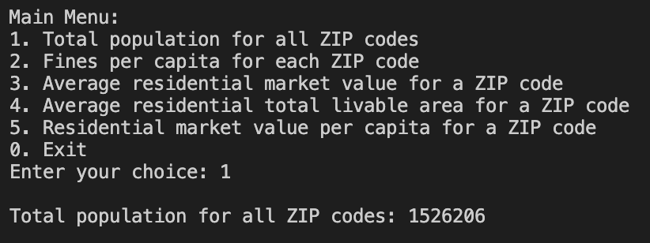
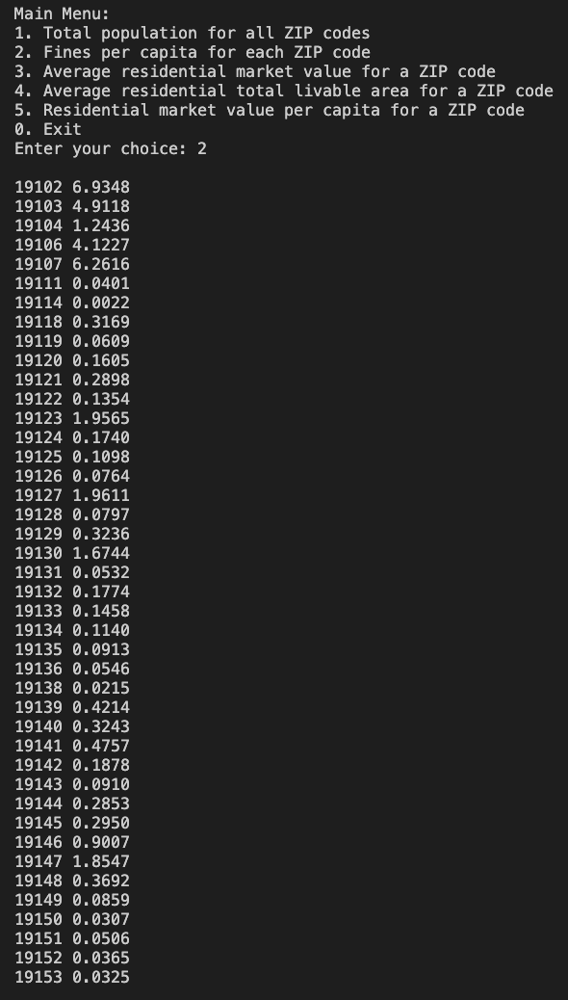
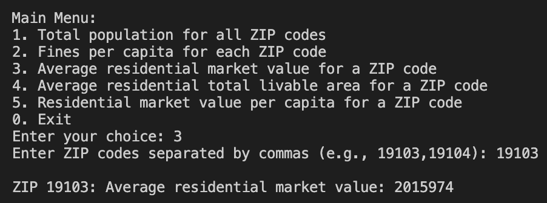
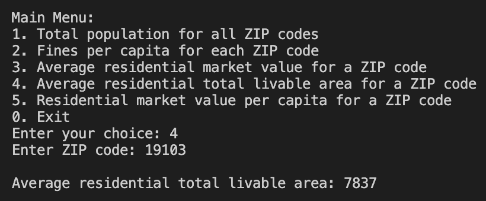
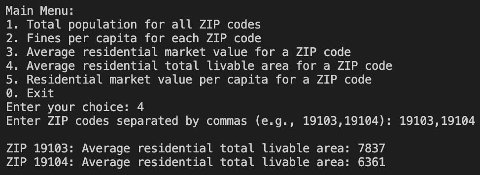
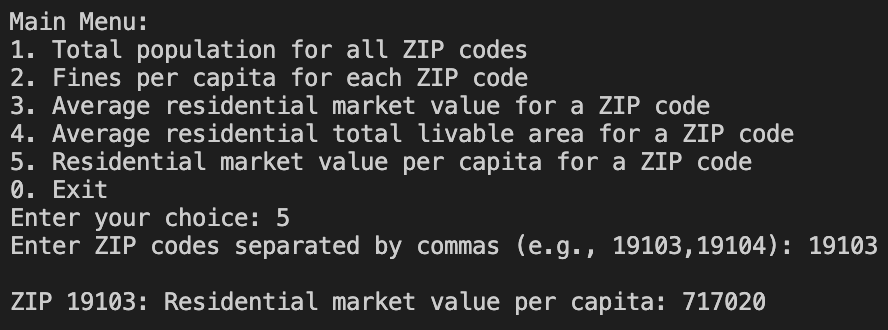
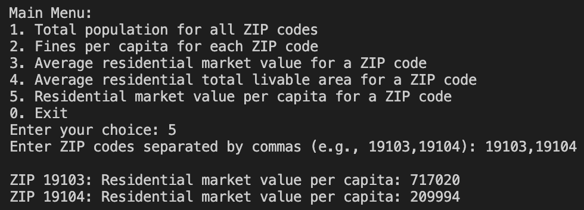
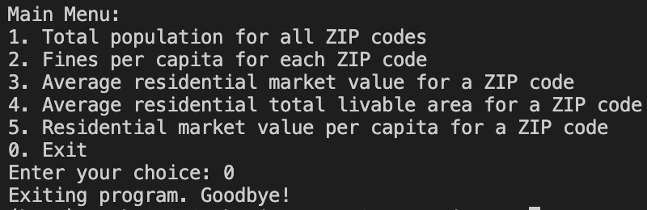

# Philadelphia Parking Violations and Property Data Analysis

This Java application processes and analyzes data from OpenDataPhilly regarding parking violations and property values in Philadelphia.


## Project Structure

```
src/
├── Main.java                    # Main entry point with menu system
├── ParkingViolation.java        # Data model for parking violations
├── Property.java                # Data model for properties
├── ParkingViolationReader.java  # Reads parking violations from CSV/JSON
├── PropertyReader.java          # Reads property data from CSV
├── PopulationReader.java        # Reads population data
└── DataProcessor.java           # Performs calculations and data processing
```

## Requirements

- Java 8 or higher
- JSON.simple library (json-simple-1.1.1.jar)

## Setup

1. The JSON.simple library (json-simple-1.1.1.jar) is already included in the `lib/` directory.

2. Compile the Java files:
   ```bash
   mkdir -p bin
   javac -d bin -sourcepath src -cp ".:lib/json-simple-1.1.1.jar" \
     src/common/*.java \
     src/datamanagement/*.java \
     src/processor/*.java \
     src/presentation/*.java
   ```

3. Run the program:
   ```bash
   java -cp ".:bin:lib/json-simple-1.1.1.jar" presentation.Main <format> <parking_file> <properties_file> <population_file>
   ```

   CSV Example:
   ```bash
   java -cp ".:bin:lib/json-simple-1.1.1.jar" presentation.Main csv data/parking.csv data/properties.csv data/population.txt
   ```
   
   Or with JSON format:
   ```bash
   java -cp ".:bin:lib/json-simple-1.1.1.jar" presentation.Main json data/parking.json data/properties.csv data/population.txt
   ```

## Command-Line Arguments

The program requires exactly 4 arguments (in order):
1. **Format**: Either `csv` or `json` (case-sensitive) - specifies the format of the parking violations file
2. **Parking file**: Path to the parking violations file (CSV or JSON)
3. **Properties file**: Path to the properties CSV file
4. **Population file**: Path to the population text file

## Features

The application provides a menu-driven interface with the following options:

1. **Total population for all ZIP codes** - Displays the sum of all populations
2. **Fines per capita for each ZIP code** - Shows parking fines per person for each ZIP code (only PA violations)
3. **Average residential market value** - Calculates average property value for a specified ZIP code
4. **Average residential total livable area** - Calculates average square footage for a specified ZIP code
5. **Residential market value per capita** - Calculates total property value divided by population for a ZIP code
0. **Exit** - Terminates the program

## Program Usage

After starting the program with valid arguments, you will see the main menu. The program uses a menu-driven interface where you select options by entering numbers.

### Main Menu

The main menu displays the following options:

```
Main Menu:
1. Total population for all ZIP codes
2. Fines per capita for each ZIP code
3. Average residential market value for a ZIP code
4. Average residential total livable area for a ZIP code
5. Residential market value per capita for a ZIP code
0. Exit
Enter your choice:
```

**Input**: Enter a number (0-5) corresponding to your desired option.

**Output**: The menu will be displayed again after each operation completes.

### Menu Option 1: Total Population for All ZIP Codes

**Input**: Enter `1` when prompted at the main menu.

**Expected Output**: 
```
Total population for all ZIP codes: 1526206
```



### Menu Option 2: Fines Per Capita for Each ZIP Code

**Input**: Enter `2` when prompted at the main menu.

**Expected Output**: 
```
19103 0.0284
19104 0.0312
...
```

The output displays:
- One ZIP code per line
- ZIP code in ascending numerical order
- Fines per capita formatted to 4 decimal places
- Only ZIP codes with non-zero fines and population 



**_Notes for Option 3-5_**: 
- The program accepts multiple ZIP codes separated by commas
- ZIP codes are automatically normalized to their first 5 digits
- If a ZIP code has no residences, the value displayed will be 0
- Invalid market values (missing, non-numeric, negative, or zero) are ignored

### Menu Option 3: Average Residential Market Value

**Input**: 
1. Enter `3` when prompted at the main menu.
2. When prompted "Enter ZIP codes separated by commas (e.g., 19103,19104):", enter one or more ZIP codes separated by commas.

**Example Input**: `19103` or multiple codes like `19103,19104`

**Expected Output** (single ZIP code):
```
ZIP 19103: Average residential market value: 2015974
```



**Expected Output** (multiple ZIP codes):
```
ZIP 19103: Average residential market value: 2015974
ZIP 19104: Average residential market value: 922763

```


### Menu Option 4: Average Residential Total Livable Area

**Input**: 
1. Enter `4` when prompted at the main menu.
2. When prompted "Enter ZIP codes separated by commas (e.g., 19103,19104):", enter one or more ZIP codes separated by commas.

**Example Input**: `19103` or multiple codes like `19103,19104`

**Expected Output** (single ZIP code):
```
ZIP 19103: Average residential total livable area: 7837
```



**Expected Output** (multiple ZIP codes):
```
ZIP 19103: Average residential total livable area: 7837
ZIP 19104: Average residential total livable area: 6361
```




### Menu Option 5: Residential Market Value Per Capita

**Input**: 
1. Enter `5` when prompted at the main menu.
2. When prompted "Enter ZIP codes separated by commas (e.g., 19103,19104):", enter one or more ZIP codes separated by commas.

**Example Input**: `19103` or multiple codes like `19103,19104`

**Expected Output** (single ZIP code):
```
ZIP 19103: Residential market value per capita: 717020
```



**Expected Output** (multiple ZIP codes):
```
ZIP 19103: Residential market value per capita: 717020
ZIP 19104: Residential market value per capita: 209994
```



### Menu Option 0: Exit

**Input**: Enter `0` when prompted at the main menu.

**Expected Output**: 
```
Exiting program. Goodbye!
```



The program will then terminate.

### Invalid Input Handling

- If you enter a non-integer value at the main menu, the menu will be displayed again
- If you enter an invalid menu option (not 0-5), the menu will be displayed again
- Invalid ZIP code inputs will result in a value of 0 being displayed (for options 3, 4, and 5)

## Data Validation

The program handles invalid data gracefully:
- Missing, non-numeric, negative, or zero values for market value and total livable area are ignored
- Parking violations with missing ZIP codes or non-PA license plates are excluded from fines per capita calculations
- ZIP codes are normalized to their first 5 digits

## Notes

- For groups of 3, you'll need to implement menu options 6 and 7 (to be approved by your Project Manager)
- The program expects well-formed input files (assuming they exist and can be opened)
- ZIP codes may be missing for some entries, which the program handles appropriately

